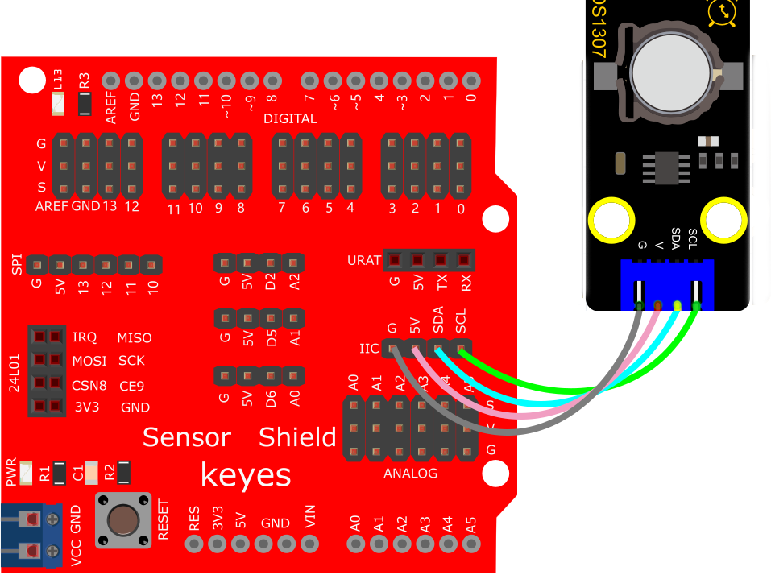

# Arduino


## 1. Arduino简介  

Arduino是一种开源电子原型平台，基于灵活的硬件和软件。它为初学者和专业人员提供了极其便捷的方式，用于创建各种互动项目，包括机器人、家庭自动化、传感器监测等。Arduino 板包含一个微控制器，用于读取输入信号（如传感器数据）并将其转换成输出，来控制电动机、LED灯、屏幕等设备。  

Arduino的开发环境，Arduino IDE，具有简单易用的图形化界面，支持使用C/C++语言编写代码。Arduino社区庞大，提供了丰富的库和示例代码，使用户能够轻松分享和获取项目资源，进而加速学习和创新。  

Arduino平台支持多种传感器和模块，适用于物联网（IoT）相关应用，可通过Wi-Fi或蓝牙实现远程控制。此外，Arduino的可扩展性强，允许与众多平台和硬件兼容，成为学习电子和编程的理想选择。  

## 2. 接线图  

  

## 3. 测试代码  

```cpp  
#include <Wire.h>  
#include "RtcDS1307.h" // DS1307时钟模块的库  

RtcDS1307<TwoWire> Rtc(Wire); // i2c接口  

void setup() {  
    Rtc.Begin();  
    Rtc.SetIsRunning(true);  
    Rtc.SetDateTime(RtcDateTime(__DATE__, __TIME__));  
    Serial.begin(9600); // 设置波特率为9600  
}  

void loop() {  
    // 打印年/月/日/时/分/秒/星期  
    Serial.print(Rtc.GetDateTime().Year());  
    Serial.print(" ");  
    Serial.print(Rtc.GetDateTime().Month());  
    Serial.print(" ");  
    Serial.print(Rtc.GetDateTime().Day());  
    Serial.print(" ");  
    Serial.print(Rtc.GetDateTime().Hour());  
    Serial.print(" ");  
    Serial.print(Rtc.GetDateTime().Minute());  
    Serial.print(" ");  
    Serial.print(Rtc.GetDateTime().Second());  
    Serial.print(" ");  
    Serial.println(Rtc.GetDateTime().DayOfWeek());  
    delay(1000); // 延时1秒  
}  
```  

## 4. 代码说明  

1. 在实验中，我们需要先导入这个时钟模块的库。  
2. `Rtc.GetDateTime()` 用于获取当前系统的时间和日期。  
3. `Rtc.Begin()` 启动DS1307实时时钟。  
4. `Rtc.SetIsRunning(true)` 初始化时钟，如果 true 值改为 false 则时间暂停。  
5. `Rtc.SetDateTime()` 设置时间。  
6. `Rtc.GetDateTime().Year()` 返回年份。  
7. `Rtc.GetDateTime().Month()` 返回月份。  
8. `Rtc.GetDateTime().Day()` 返回日期。  
9. `Rtc.GetDateTime().Hour()` 返回小时。  
10. `Rtc.GetDateTime().Minute()` 返回分钟。  
11. `Rtc.GetDateTime().Second()` 返回秒。  
12. `Rtc.GetDateTime().DayOfWeek()` 返回星期。  

## 5. 测试结果  

烧录好测试代码，按照接线图连接好线；利用USB接口上电后，进入串口监视器，设置波特率为9600。我们可在软件串口监视器中看到设置时间日期（年、月、日、时、分、秒、周），如下图。  


