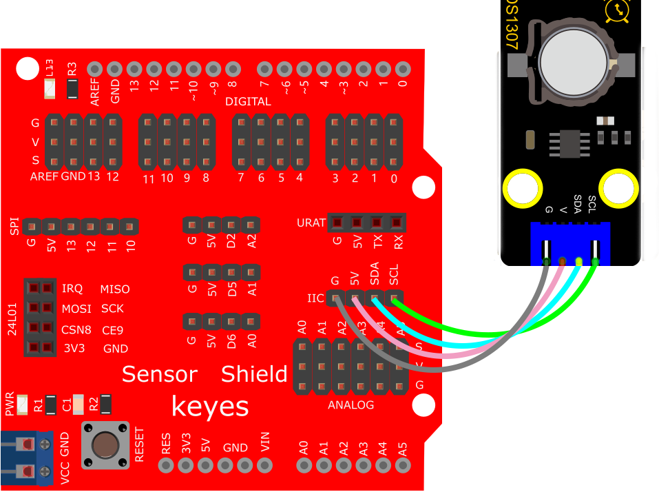
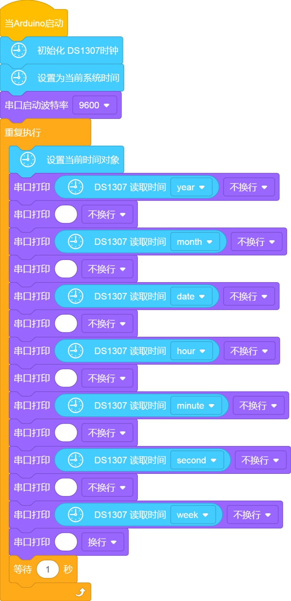
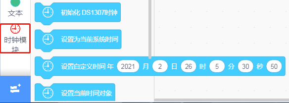
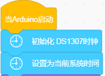
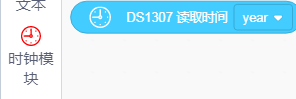
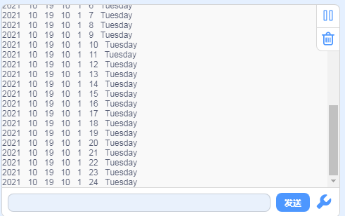

# KidsBlock

## 1. Kidsblock简介  

Kidsblock是一款面向儿童及初学者的可视化编程工具，通过简单易用的图形化界面，让学生们可以轻松学习编程和机器人技术。它允许用户通过拖拽代码模块，进行编程设计，适合多种硬件平台，能够帮助用户实现各种创意项目诸如传感器控制、模拟游戏和电子艺术等。  

Kidsblock的设计目的在于培养学童的想象力和逻辑思维能力，以丰富的项目示例和教程，鼓励他们在实践中探索编程的乐趣。通过与Arduino等平台的结合，Kidsblock使得学习编程变得更加直观，适合教育领域和课外活动。  

## 2. 接线图  

  

## 3. 测试代码  

  

## 4. 代码说明  

### 4.1 添加扩展模块  

我们首先添加扩展DS1307模块。  

### 4.2 初始化时钟模块  

然后代码开始的时候初始化DS1307时钟模块，设置系统时间即当前时间。  

  

### 4.3 读取系统时间  

同样方式再找到代码块，用于读取系统的时间，获取年、月、日、时、分、秒、周。  

  

### 4.4 显示时间  

然后我们把时间显示在串口监视器上。  

## 5. 测试结果  

烧录好测试代码，按照接线图连接好线；利用USB接口上电后，我们可在软件串口监视器中看到设置时间日期（年、月、日、时、分、秒、周），如下图。  

