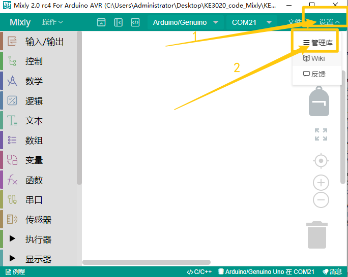
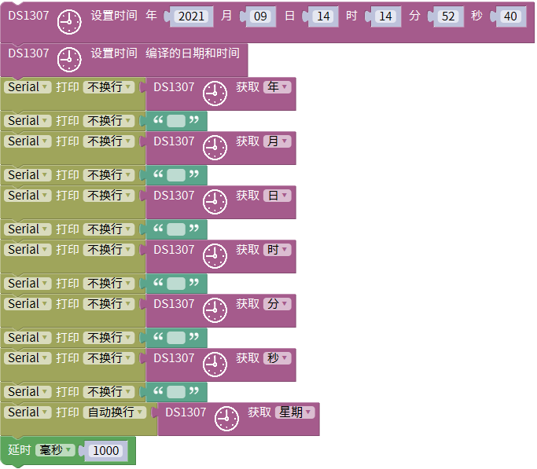
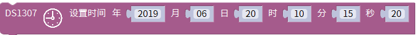
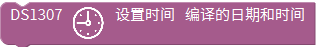
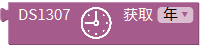
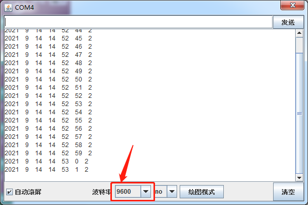

# Mixly

## 1. Mixly简介  

Mixly是一款针对初学者的可视化编程工具，使编程变得简单易懂。它采用拖曳式界面，用户可以通过拼接各种代码模块，而无需深入了解编程语法，因此适合各种年龄段的学习者和教育工作者。Mixly支持多种硬件平台，如Arduino、Micro:bit等，并兼容多种传感器和模块，极大地方便了项目开发。  

Mixly不仅可以帮助用户学习基本的编程知识，还鼓励创意思维和解决问题的能力。该平台提供了丰富的教学资源和项目示例，使得学习过程既有趣又具有挑战性。通过使用Mixly，学生们能够在实践中掌握编程技能，提高他们的逻辑思维和创造力。  

## 2. 接线图  

  

## 3. 测试代码  

- 下载资料：[Mixly](./Mixly.7z)

- 点击“设置”---->“管理库”

  

- 选择本地导入，选择下载资源的库文件，选择库文件中的“.xml”后缀的文件导入。

  

  

## 4. 代码说明  

我们在库keyes sensor下的“其他模块”单元找到DS1307模块，并把时间设置成实时时间。  

  

如果模块上没有电池，那么我们就要设置；如果模块带了电池，那么模块自动在运行，我们就只需要这句代码块。  

  

同样方式再找到代码块，用于获取系统的时间，有年月日时分秒周。  

  

## 5. 测试结果  

烧录好测试代码，按照接线图连接好线；利用USB接口上电后，进入串口监视器，设置波特率为9600。我们可在软件串口监视器中看到设置时间日期（年、月、日、时、分、秒、周），如下图。  

