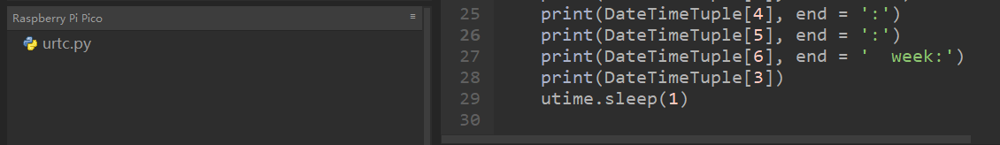

# Python


## 1. Python简介  

Python是一种高级编程语言，因其简洁易读的语法而广受欢迎。它是通用的多范式编程语言，支持面向对象、命令式及函数式编程风格。Python的灵活性和强大的库支持使其广泛应用于数据分析、机器学习、网络开发、自动化脚本以及科学计算等多个领域。  

Python拥有丰富的第三方库和模块，包括数值计算库NumPy、数据分析库Pandas、Web开发框架Flask和Django等，极大地增强了其功能性和应用范围。此外，Python的社区活跃，用户可轻松获取学习资源、代码示例和项目支持，适合各种水平的开发人员，无论是新手还是资深专业人士。  

## 2. 接线图  

  

## 3. 测试代码  

```python  
from machine import I2C, Pin  
from urtc import DS1307  
import utime  

i2c = I2C(1, scl=Pin(15), sda=Pin(14), freq=400000)  
rtc = DS1307(i2c)  

year = int(input("Year : "))  
month = int(input("month (Jan --> 1 , Dec --> 12): "))  
date = int(input("date : "))  
day = int(input("day (1 --> monday , 2 --> Tuesday ... 0 --> Sunday): "))  
hour = int(input("hour (24 Hour format): "))  
minute = int(input("minute : "))  
second = int(input("second : "))  

now = (year, month, date, day, hour, minute, second, 0)  
rtc.datetime(now)  

# (year, month, date, day, hour, minute, second, p1) = rtc.datetime()  
while True:  
    DateTimeTuple = rtc.datetime()  
    print(DateTimeTuple[0], end='-')  
    print(DateTimeTuple[1], end='-')  
    print(DateTimeTuple[2], end=' ')  
    print(DateTimeTuple[4], end=':')  
    print(DateTimeTuple[5], end=':')  
    print(DateTimeTuple[6], end=' week:')  
    print(DateTimeTuple[3])  
    utime.sleep(1)  
```  

## 4. 代码说明  

在实验中，我们需要先导入`urtc`模块，导入方法我们之前已经讲过，导入后如下图可看到：  

  

1. `rtc.datetime()` 返回的是一个时间日期的元组。  
2. 在程序运行时，设置了“请输入”程序，运行代码会提示我们输入时间与日期。  
3. 输入完成后，每隔一秒打印一次数据。  

   - `DateTimeTuple[0]` 存放年份  
   - `DateTimeTuple[1]` 存放月份  
   - `DateTimeTuple[2]` 存放日  
   - `DateTimeTuple[3]` 存放星期  
   - `DateTimeTuple[4]` 存放时  
   - `DateTimeTuple[5]` 存放分  
   - `DateTimeTuple[6]` 存放秒  

## 5. 测试结果  

烧录好测试代码，按照接线图连接好线；利用USB接口上电后，进入串口监视器，设置波特率为9600。我们可在软件串口监视器中看到设置的时间日期（年、月、日、时、分、秒、周），如下图。  


